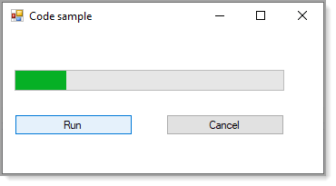
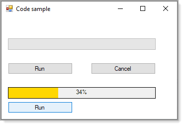
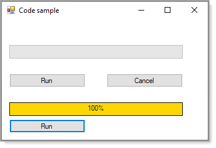
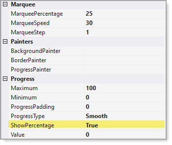

# About

Basic/simple example for performing  asynchronous programming with cancellation, delegate and progress bar.

## Example 1

Using standard Progressbar with cancel option

## Example 2 

Using [ProgressODoom](https://www.nuget.org/packages/ProgressODoom/) via NuGet package.

