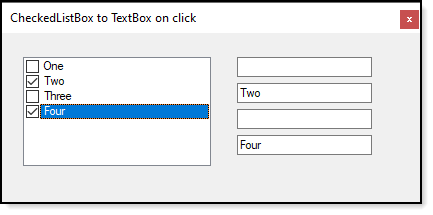

# About

Simple code sample that assocates a CheckedListBox item with a TextBox.

There are other ways to perform this while this is simple enough for novice coders to work with.

## Coded with

Microsoft Visual Studio 2019, .NET Framework 4.8 while this will also work for .NET 5 in a .NET Core project too.