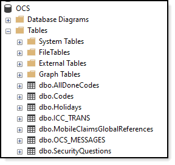

# About

The intent for this project (in tangent with this [backend project](https://github.com/karenpayneoregon/forum-questions/tree/master/ClaimsLibrary)) is to show how decent code can be great code by first introducing decent code then move to how can the decent code be done better.

Note that what is presented here is not fully documented and is being shown for how in some cases when learning there will be multiple options shown to perform specific task.

For instance, the three methods below produce the exact same results.

**C# code samples**
```csharp
private static void GetAllDoneCodes1()
{
    using (var context = new OcsContext())
    {
        context.AllDoneCodes.ToList().ForEach(
            code => Console.WriteLine($"{code.Id}, {code.Code}, {code.Description}"));
    }
   
}

private static void GetAllDoneCodes2()
{
    using var context = new OcsContext();

    context.AllDoneCodes.ToList().ForEach(
        code => Console.WriteLine($"{code.Id}, {code.Code}, {code.Description}"));

}

private static void GetAllDoneCodes3()
{
    using var context = new OcsContext();

    context.AllDoneCodes.ToList().ForEach(Console.WriteLine);

}
```

**Same done in VB.NET**

```

Private Shared Sub GetAllDoneCodes1()
    Using context = New OcsContext()
        context.AllDoneCodes.ToList().ForEach(Sub(code) Console.WriteLine($"{code.Id}, {code.Code}, {code.Description}"))
    End Using

End Sub

Private Shared Sub GetAllDoneCodes2()
    Using context = New OcsContext()
        context.AllDoneCodes.ToList().ForEach(Sub(code) Console.WriteLine($"{code.Id}, {code.Code}, {code.Description}"))
    End Using
End Sub

Private Shared Sub GetAllDoneCodes3()
    Using context = New OcsContext()
        context.AllDoneCodes.ToList().ForEach(AddressOf Console.WriteLine)
    End Using
End Sub
```

# Working with data

The code reads from a SQL-Server database which has several tables.



There is a class with a connection string (normally the connection string would not be hard coded)

```csharp
protected override void OnConfiguring(DbContextOptionsBuilder optionsBuilder)
{
    if (!optionsBuilder.IsConfigured)
    {
        optionsBuilder.UseSqlServer(
            "Data Source=.\\SQLEXPRESS;Initial Catalog=OCS;Integrated Security=True");
    }
}
```

To transition to Oracle the only change (keeping in mind the table defintions are the same) is the connection string.

## Where are the data classes?

The classes for data are in the project ClaimsLibrary.

- Each table is represented by a class.
- Classes have many options such as annotating column names e.g. TR_SSN can be TrSsn

```csharp
[Column("TR_SSN")]
public double? TrSsn { get; set; }
```


