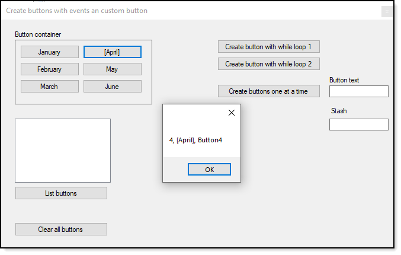

# About

A common question in developer forums is how to create dynamic buttons without consideration for the Click event.

This project uses a custom button with several custom properties to assist with working with logic in the button click event like storing a primary key from a database table to retrieve data.

:yellow_circle:  `.NET Framework` is used and will work with `.NET Core Framework` too Only reason for not using .NET Core is this way both Frameworks can use this code.

| Class/module |  Definition
| :---- | :---- | :----
| ButtonInitialization class | Used to initialize code in ButtonOperations init 
| ButtonOperations class | Responsible for creating buttons 
| Helpers | Utility methods 
| StringExtensions module | String extension methods 

## Example screen

