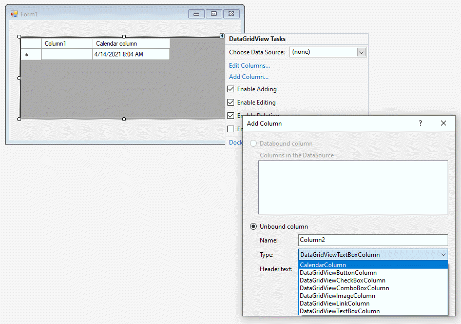
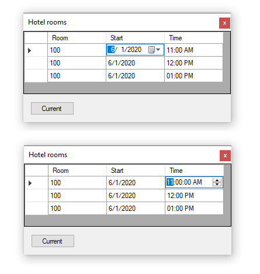

# About

Starter code for using a calendar column in a DataGridView.

See [the following article](https://social.technet.microsoft.com/wiki/contents/articles/53930.windows-forms-datagridview-dates-and-numeric-columns-c.aspx) for C# details which should be easy enough to follow for `VB.NET`

