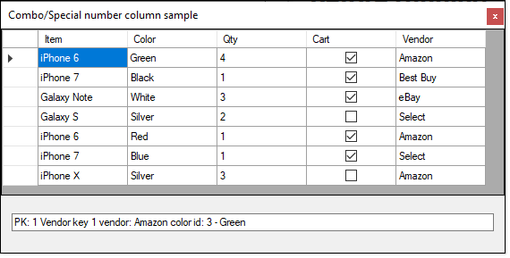
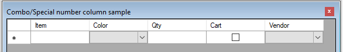

# About

Code sample for using DataGridViewComboBox and custom numeric DataGridView column. Only performs basic operations to read data.

To perform an edit operation look at the code in the form, CurrentValuesView method which shows how to get to keys that then can be used to send changes to the database.

```csharp

var productRow = ((DataRowView)_productBindingSource.Current).Row;
var customerPrimaryKey = productRow.Field<int>("Id");
var colorKey = productRow.Field<int>("ColorId");
var vendorKey = productRow.Field<int>("VendorId");

```


## Before running

> Run databasescript.sql

### Screenshot

Color and Vendor are DataGridViewComboBox columns



