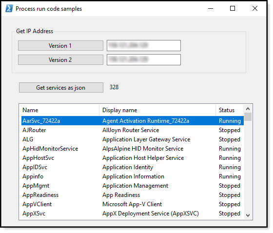

# About

This project shows how to run PowerShell operations using Process without showing a window and will direct results to a text file followed by reading the text file for results.

In one case results are in Json which will be presented in a ListView while another example shows results in TextBox controls.

# Requires

