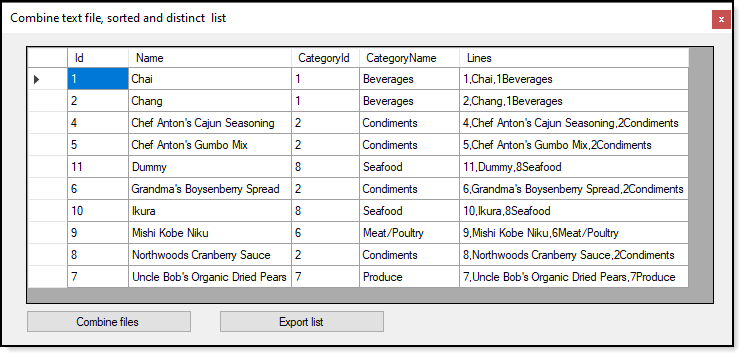

# About

This code sample demonstrates a [SortedSet](https://docs.microsoft.com/en-us/dotnet/api/system.collections.generic.sortedset-1?view=net-5.0) to add unique items to a list using [IComparer](https://docs.microsoft.com/en-us/dotnet/api/system.collections.icomparer?view=net-5.0) Interface to sort on a specific property of the items.

- A DataGridView is used to inspect that all worked as expected.
- The `Conbine files` button is where all the magic happens by calling a method in the `FileOperations class`.
- Clicking `Export list` button writes all information to a file using the `Lines` property of each item to a [StringBuilder](https://docs.microsoft.com/en-us/dotnet/api/system.text.stringbuilder?view=net-5.0) object then save to a specific file.

Three files are read in with duplicate products and returns no duplicates to write to a new file. Each file are in the project with `Copy to output folder` set to `Copy always` which allows to playing around e.g. remove a propert, remove a comma etc. Then is something code can be changed to assert for a specific issue. What should happen when adapting this code is to not use a Forms project but use a class project and validate using a unit test project.

## Exception handling

There are two events which when subscribed to will provide access to a runtime exception as it occurs.

```
Public Delegate Sub OnMalformedLineExceptionDelegate(exception As FileIO.MalformedLineException, FileName As String)
Public Shared Event MalformedLineExceptionHandler As OnMalformedLineExceptionDelegate

Public Delegate Sub OnExceptionDelegate(exception As Exception, FileName As String)
Public Shared Event ExceptionHandler As OnExceptionDelegate
```





# Container

```
Namespace Classes
    Public Class Product

        Public Property Id() As Integer
        Public Property Name() As String
        Public Property CategoryId() As Integer
        Public Property CategoryName() As String
        Public ReadOnly Property Lines() As String
            Get
                Return $"{Id},{Name},{CategoryId}{CategoryName}"
            End Get
        End Property
        Public Overrides Function ToString() As String
            Return $"{CategoryName}, {Name}"
        End Function

    End Class
End NameSpace
```

# Comparer for Products

Setup to sort on `Name` property of `Product`

```
Namespace Classes
    Friend Class ProductComparer
        Implements IComparer(Of Product)

        Public Function Compare(ByVal x As Product, ByVal y As Product) As Integer _
            Implements IComparer(Of Product).Compare

            Dim result As Integer = String.Compare(x.Name, y.Name, StringComparison.Ordinal)
            Return result

        End Function

    End Class
End NameSpace
```

