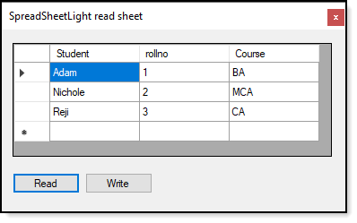

# About

Code sample for a forum question to 

:heavy_check_mark: Read a WorkSheet into a DataTable, present in a DataGridView. 
:heavy_check_mark: Write DataTable back to Excel WorkSheet

# Requires

NuGet package [SpreadSheetLight](https://www.nuget.org/packages/SpreadsheetLight/) (this project uses version 3.5.0)

# Extra

:heavy_check_mark:  Some simple SpreadSheetLight [operations](https://github.com/karenpayneoregon/ExcelUnleashed/tree/master/SpreadSheetLightLibrary).

