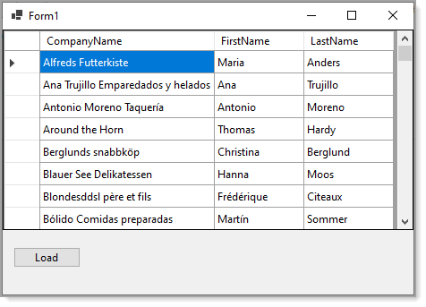

# About

Simple, no frills load data table async

- To run, use the following [database script](https://gist.github.com/karenpayneoregon/40a6e1158ff29819286a39b7f1ed1ae8) for a modified NorthWind database.
- Done in VS2019, .NET5



# Form code

```
Imports SqlSamples.Classes

Public Class Form1
    Private Async Sub LoadDataTableButton_Click(sender As Object, e As EventArgs) _
        Handles LoadDataTableButton.Click

        Dim dt = Await Operations.LoadCustomersAsync()

        DataGridView1.InvokeIfRequired(
            Sub(dgv)
                dgv.DataSource = dt
            End Sub)
    End Sub
End Class
```

# Data operations

```
Imports System.Data.SqlClient

Namespace Classes

    Public Class Operations

        Private Shared ConnectionString As String =
                           "Data Source=.\SQLEXPRESS;" &
                           "Initial Catalog=NorthWind2020;" &
                           "Integrated Security=True"


        Public Shared Async Function LoadCustomersAsync() As Task(Of DataTable)

            Dim dt = New DataTable()

            Dim commandText =
                    <SQL>
                        SELECT C.CustomerIdentifier, 
                               C.CompanyName, 
                               C.ContactId, 
                               CT.FirstName, 
                               CT.LastName
                        FROM Customers AS C
                             INNER JOIN Contacts AS CT ON C.ContactId = CT.ContactId;
                    </SQL>.Value

            Using da = New SqlDataAdapter(commandText, ConnectionString)
                Await Task.Run(Function() da.Fill(dt))
            End Using


            dt.Columns("CustomerIdentifier").ColumnMapping = MappingType.Hidden
            dt.Columns("ContactId").ColumnMapping = MappingType.Hidden

            Return dt

        End Function

    End Class
End Namespace
```

# Prevent cross threading

```
Imports System.ComponentModel
Imports System.Runtime.CompilerServices

Namespace Classes
    Public Module ControlExtensions

        <Extension>
        Public Sub InvokeIfRequired(Of T As ISynchronizeInvoke)(ByVal control As T, action As Action(Of T))

            If control.InvokeRequired Then
                control.Invoke(New Action(Sub() action(control)), Nothing)
            Else
                action(control)
            End If
        End Sub

    End Module
End NameSpace
```