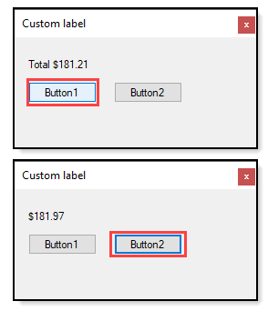

# About

[Forum question](https://docs.microsoft.com/en-us/answers/questions/334501/labeltext-to-34c34-help.html)

Simple code sample for a custom label which by invoking one of the overloaded SetDoubleValue
in tanget with setting DoubleFormat property formats the label text property.

Why not simply use .ToString("C") ?

Because some coders will attempt this with something like `lblLabor.Text = (txtBoxLabor.Text + Result).ToString("C")` were we have text value and a double value which will not work especially with `Option Strict On`



```
Imports System.ComponentModel

Public Class CurrencyFormattedLabel
    Inherits Label

    Public Sub New()
        DoubleFormat = "c"
    End Sub

    Public Sub SetDoubleValue(value As Double)
        Text = value.ToString(DoubleFormat)
    End Sub
    Public Sub SetDoubleValue(caption As String, value As Double)
        Text = value.ToString(DoubleFormat)
        Text = $"{caption} {value.ToString(DoubleFormat)}"
    End Sub
    Public Sub SetDoubleValue(value1 As Double, value2 As Double)
        Text = (value1 + value2).ToString(DoubleFormat)
    End Sub
    Public Sub SetDoubleValue(caption As String, value1 As Double, value2 As Double)
        Text = $"{caption} {(value1 + value2).ToString(DoubleFormat)}"
    End Sub
    Public Sub SetDoubleValue(caption As String, ParamArray args() As Double)
        Text = $"{caption} {args.Sum().ToString(DoubleFormat)}"
    End Sub
    Public Sub SetDoubleValue(ParamArray args() As Double)
        Text = args.Sum().ToString(DoubleFormat)
    End Sub

    <Category("Behavior"), Description("Format for SetDoubleValue")>
    Public Property DoubleFormat As String
End Class
```
