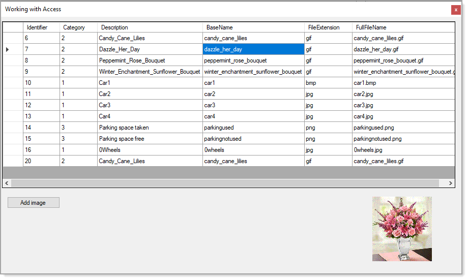

# About

Simple example for inserting images into a MS-Access database. Hacked from my VB.NET [code sample](https://github.com/karenpayneoregon/WorkingWithAccessDatabases/tree/master/AddingMultipleRecords).

- Although this fully works there are clean-up to be done.
- Images are shown in a PictureBox but could also be shown in the DataGridView rather than a PictureBox.

