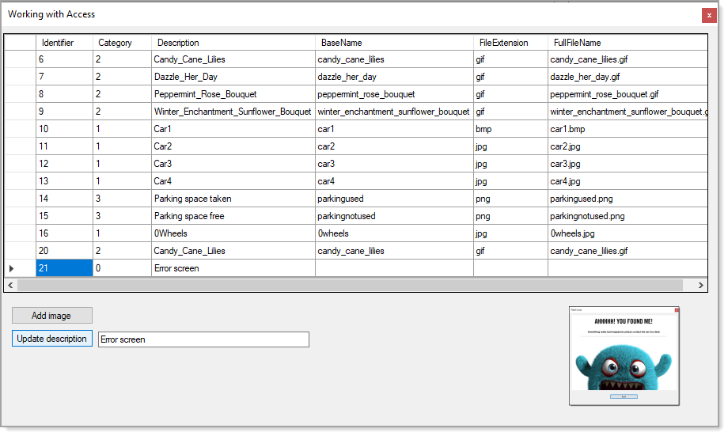

# About

Simple example for inserting images into a MS-Access database. Hacked from my VB.NET [code sample](https://github.com/karenpayneoregon/WorkingWithAccessDatabases/tree/master/AddingMultipleRecords).

There is enough done in the code to prove add and edit works.

- Although this fully works there are clean-up to be done.
- Add new record does not populate all columns in the database table, just enough to show this works.
- There is a one field update method for description to show editing works. We could do the same for picture column using the same technique used in the add new record and would be successful.
- Images are shown in a PictureBox but could also be shown in the DataGridView rather than a PictureBox.

Here a record was added followed by changing the new record's description column.

