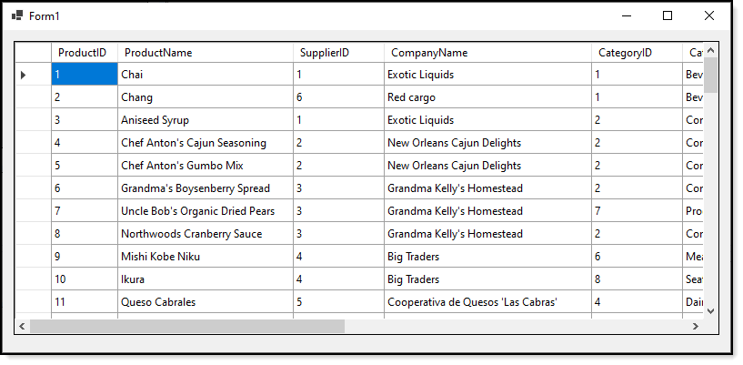

# About

Sample to open tables in SQL-Server using a data provider with async operations and given timeout for a connection.

:heavy_check_mark: This is a no-frills user interface.

:heavy_check_mark: Uses C#8, C#9 features



# Requires 

:heavy_check_mark: The following [database script](https://gist.github.com/karenpayneoregon/9bdf1a7d5310ac1d562b2326d79d6038) to run.


Once this project is open in Visual Studio with .NET 5 installed, double click on the project 
node (the project name) in Visual Studio which open too.

Note if this was a console app remove the **-window** section from the TargetFramework node.


```xml
<Project Sdk="Microsoft.NET.Sdk">


	<PropertyGroup>
		<OutputType>WinExe</OutputType>
		<LangVersion>9.0</LangVersion>
		<TargetFramework>net5.0-windows</TargetFramework>
		<UseWindowsForms>true</UseWindowsForms>
	</PropertyGroup>


	<ItemGroup>
	  <PackageReference Include="System.Data.SqlClient" Version="4.8.2" />
	</ItemGroup>


</Project>
```

Note the `ItemGroup` section, this informs .NET that a package for `System.Data.SqlClient` is needed. When building this project Visual Studio should restore the package and if not
 right click on the project name in solution explorer, select `manage NuGet packages`, do a restore by pressing the restore button.

Or simply install via [instructions here](https://www.nuget.org/packages/System.Data.SqlClient/).

Now build the project.